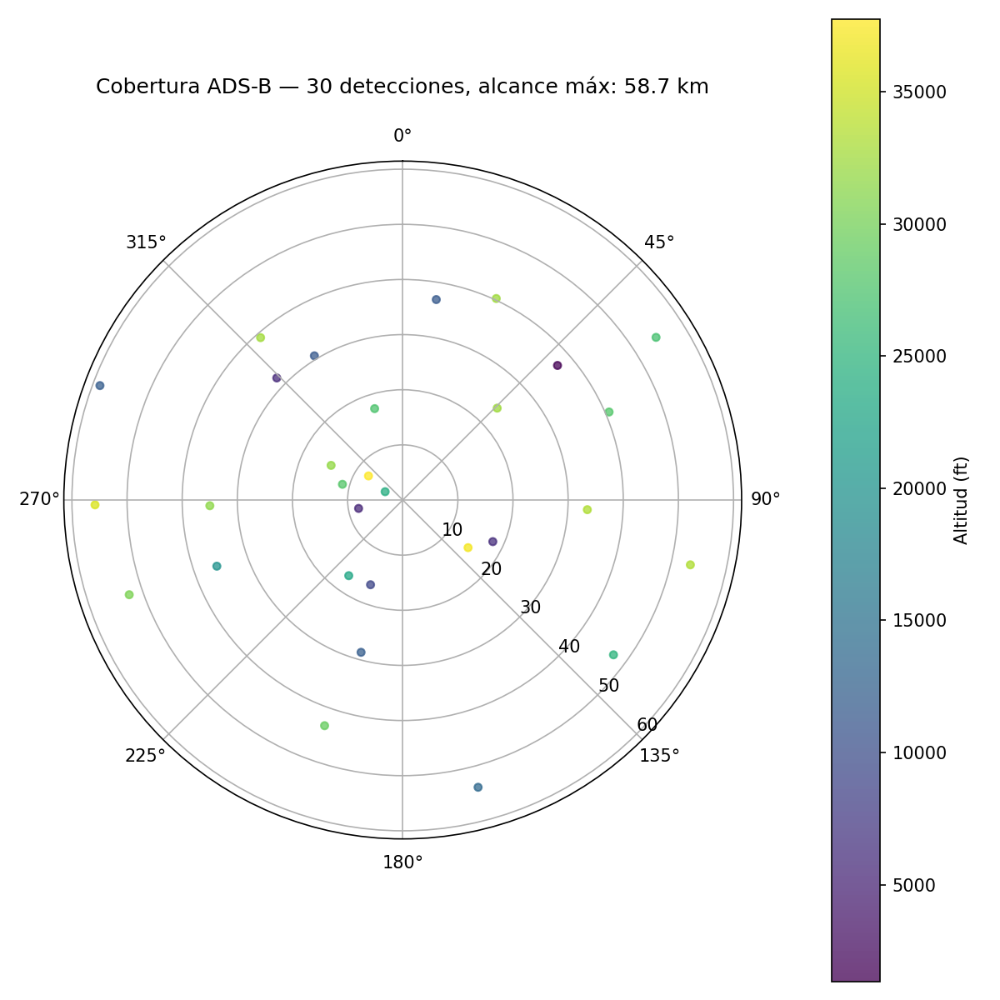

# 📡 Portfolio de Ingeniería RF & Telecomunicaciones

🇪🇸 Español | 🇬🇧 [English version](README.en.md)

> Proyectos prácticos de RF, antenas, SDR y sistemas de comunicación, diseñados, fabricados y medidos de principio a fin.

**🌐 [Ver la web del portfolio →](https://alvgj-ugr.github.io/telecom-portfolio/)** · 📋 [Estado y próxima tarea](PROJECT_STATE.md) · 🗺️ [Roadmap detallado](docs/roadmap.md)

  
  
  

## Cómo leer este repositorio

1. **¿Solo quieres una visión general?** → la [web del portfolio](https://alvgj-ugr.github.io/telecom-portfolio/) resume los 4 proyectos con gráficas y CAD.
2. **¿Quieres el detalle técnico?** → cada carpeta de `projects/` tiene su propio README con metodología, simulaciones y datos.
3. **¿Quieres saber en qué se está trabajando ahora?** → [`PROJECT_STATE.md`](PROJECT_STATE.md) (estado real, sesión a sesión) y [`MASTER_PLAN.md`](MASTER_PLAN.md) (plan por fases).

## Sobre mí

Estudiante de Ingeniería de Telecomunicaciones (Universidad de Granada). Este repositorio documenta proyectos personales de RF, diseño de antenas, SDR y sistemas de comunicación embebidos, construidos en tiempo libre con equipo propio: impresora 3D, soldador, dongle SDR y un NanoVNA.

Cada proyecto sigue el mismo ciclo de ingeniería: **diseño → simulación → fabricación → medición → iteración**, con scripts, datos y fuentes CAD reales en el propio repo — no solo capturas de pantalla.

## 🧰 Herramientas y equipo

| Categoría | Herramientas |
|---|---|
| RF / Medición | RTL-SDR Blog v3, NanoVNA |
| Fabricación | Impresora 3D (PLA/PETG), estación de soldadura |
| Software | GNU Radio, SDR++/SDR#, KiCad, 4nec2 / PyNEC, Python (NumPy/SciPy/Matplotlib) |
| Embebido | ESP32, Arduino, módulos LoRa SX1276/78 |
| Protocolos | ADS-B, LoRa (Meshtastic), APT/LRPT, MQTT, rotctld/Hamlib |

## 📂 Proyectos

| # | Proyecto | Estado | Frecuencia | Lo más destacable |
|---|---|---|---|---|
| 01 | [Fundamentos SDR: Espectro + ADS-B](projects/01-sdr-fundamentals/) | 🟡 En progreso | 1090 MHz | Pipeline completo validado con datos reales de ejemplo; falta el RTL-SDR |
| 02 | [Diseño de antenas + NanoVNA](projects/02-antenna-design-vna/) | 🟡 En progreso | 868 MHz / 2.4 GHz | 3 antenas (Yagi/biquad/hélice) simuladas en NEC2 y con CAD validado geométricamente |
| 03 | [Estación terrena de satélites](projects/03-satellite-ground-station/) | 🟡 En progreso — prioritario | 137 MHz | Rotor Az/El con homing real + cliente de seguimiento standalone (Skyfield) |
| 04 | [Red LoRa/Meshtastic alpina](projects/04-alpine-mesh-tracking/) | 🔵 Planeado | 868 MHz | Diseño y asunciones explícitas, pendiente de verificación física |

**Leyenda:** 🔵 Planeado · 🟡 En progreso · 🟢 Completado

## 🔗 Proyecto relacionado (repositorio aparte)

- **[wifi-csi-presence-sensing](https://github.com/AlvGJ-UGR/wifi-csi-presence-sensing)** — sensado de presencia por WiFi CSI en ESP32 (línea de trabajo distinta, repositorio propio).

## 🎯 Habilidades demostradas

Diseño de antenas RF (simulación NEC2, fabricación, medición con VNA) · SDR y procesamiento de señal · sistemas embebidos (ESP32, control de motores, homing) · mecánica orbital y seguimiento satelital · documentación técnica honesta, incluyendo discrepancias simulación-vs-medición cuando aparecen.

## 📫 Contacto

- Email: alvarogj1@correo.ugr.es
- LinkedIn / CV: *(añadir enlaces)*

## Licencia

MIT — ver [LICENSE](LICENSE).
