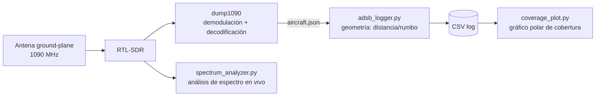
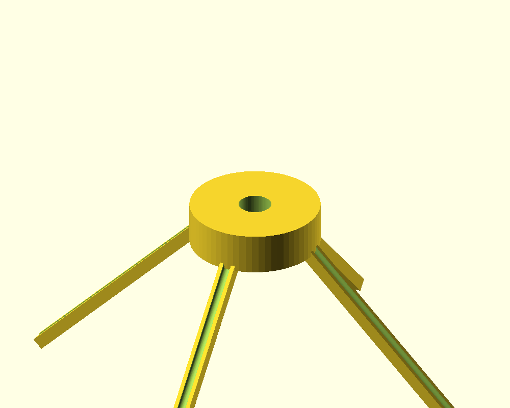
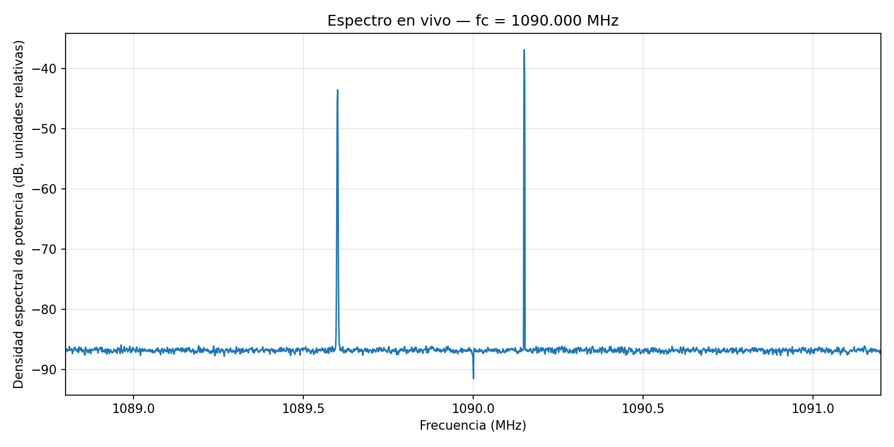

# 01 — Fundamentos SDR: Espectro en vivo + ADS-B

**Estado:** 🟡 En progreso — código y diseño de antena completos, pendiente de captura con hardware real

## Objetivo

Construir un sistema completo de recepción RF: desde una antena diseñada y fabricada a medida, hasta la visualización de datos reales de tráfico aéreo, pasando por análisis de espectro en tiempo real. Todo el pipeline de software está terminado y probado; solo falta la captura final con el RTL-SDR físico.

## Por qué importa

Es la base del resto del portfolio: SDR es la herramienta central para los proyectos de satélites y análisis de espectro que vienen después. Además, ADS-B es uno de los pocos protocolos de comunicaciones aeronáuticas reales que se pueden recibir y decodificar legalmente con equipo casero, lo que permite validar todo el pipeline (RF → demodulación → geolocalización → visualización) con tráfico real y verificable.

## Arquitectura del sistema

## Diseño de antena

Ground-plane de cuarto de onda, diseñada específicamente para 1090 MHz (frecuencia de emisión ADS-B). Cálculo completo de dimensiones, justificación de la elección de topología, y modelo 3D paramétrico en OpenSCAD:

- 📐 [`antenna/antenna_design.md`](antenna/antenna_design.md) — cálculos y justificación de diseño
- 🖨️ [`antenna/mount.scad`](antenna/mount.scad) — modelo paramétrico (OpenSCAD)

## Código

| Script | Función |
|---|---|
| [`src/spectrum_analyzer.py`](src/spectrum_analyzer.py) | Espectro en tiempo real (PSD vía método de Welch) sobre IQ del RTL-SDR |
| [`src/adsb_logger.py`](src/adsb_logger.py) | Consulta `dump1090`, calcula distancia (Haversine) y rumbo real desde la estación, registra en CSV |
| [`src/coverage_plot.py`](src/coverage_plot.py) | Gráfico polar de cobertura (rumbo vs. alcance, coloreado por altitud) a partir del CSV |

Los tres scripts incluyen un **modo `--demo`** que genera datos sintéticos (IQ simulado / detecciones ADS-B plausibles), lo que permite probar y validar todo el pipeline de software antes de tener el hardware conectado — la evidencia de que el código funciona end-to-end está en `assets/`.

Guía completa de instalación (drivers, udev, dump1090, entorno Python): [`docs/setup_guide.md`](docs/setup_guide.md)

## Resultados

> ⚠️ Las gráficas de abajo son del **modo demo** (datos sintéticos), generadas para validar el pipeline de software. Se reemplazarán por capturas reales en cuanto esté montada la antena y funcionando el RTL-SDR.

**Espectro (demo):**

**Cobertura ADS-B (demo — geometría real, tráfico sintético):**

### Pendiente con hardware real

- [ ] Imprimir y soldar la antena según `antenna/mount.scad` y `antenna/antenna_design.md`
- [ ] Captura de espectro real en 1090 MHz, comparar suelo de ruido con/sin antena casera vs. la antena stock
- [ ] Sesión de logging ADS-B de varias horas con coordenadas reales de la estación
- [ ] Gráfico de cobertura real, alcance máximo medido vs. horizonte de radio teórico (fórmula incluida en `coverage_plot.py`)
- [ ] Tabla comparativa: antena casera vs. antena stock del dongle (alcance, nº de aviones detectados/hora)

## Habilidades demostradas

- Diseño de antenas desde primeros principios (cálculo de λ/4, adaptación de impedancia por ángulo de radiales)
- Modelado paramétrico 3D (OpenSCAD) para fabricación
- Configuración y uso de SDR (RTL-SDR, procesamiento de IQ)
- Procesamiento de señal: PSD mediante método de Welch
- Geometría esférica aplicada (Haversine, bearing) para geolocalización
- Diseño de software con modo de prueba sin hardware (testability, buena práctica de ingeniería)
