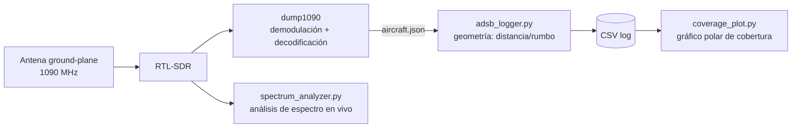

# 01 — Fundamentos SDR: Espectro en vivo + ADS-B

**Estado:** 🟡 En progreso — código y diseño de antena completos y verificados en modo demo; pendiente captura con hardware real (RTL-SDR aún no adquirido)

## Objetivo

Construir un sistema completo de recepción RF: antena diseñada y fabricada a medida → captura SDR → decodificación → geolocalización → visualización. Todo el pipeline de software está terminado, probado y con datos reales de ejemplo; solo falta la captura final con el RTL-SDR físico.

## Por qué importa

Es la base del resto del portfolio: SDR es la herramienta central de los proyectos de satélites (03) y antenas (02) que vienen después. ADS-B es además uno de los pocos protocolos de comunicaciones aeronáuticas reales que se pueden recibir y decodificar legalmente con equipo casero, lo que permite validar todo el pipeline (RF → demodulación → geolocalización → visualización) con tráfico real y verificable.

## Arquitectura del sistema

## Diseño de antena

Ground-plane de cuarto de onda para 1090 MHz — elegida sobre un colineal de fase por tener menor acumulación de error de fabricación y por ser el diseño de referencia de la comunidad RTL-SDR/ADS-B, lo que permite contrastar resultados contra referencias conocidas.

| Elemento | Cantidad | Longitud | Material |
|---|---|---|---|
| Radiador vertical | 1 | 65.3 mm | Hilo de cobre rígido 1–1.5 mm Ø |
| Radiales (45° bajo horizontal) | 4 | 68.6 mm | Hilo de cobre rígido 1–1.5 mm Ø |
| Conector | 1 | — | SMA hembra panel-mount |

📐 Cálculos y justificación completa: [`antenna/antenna_design.md`](antenna/antenna_design.md) · 🖨️ Modelo paramétrico: [`antenna/mount.scad`](antenna/mount.scad)

## Código

| Script | Función |
|---|---|
| [`src/spectrum_analyzer.py`](src/spectrum_analyzer.py) | Espectro en tiempo real (PSD vía método de Welch) sobre IQ del RTL-SDR |
| [`src/adsb_logger.py`](src/adsb_logger.py) | Consulta `dump1090`, calcula distancia (Haversine) y rumbo real desde la estación, registra en CSV |
| [`src/coverage_plot.py`](src/coverage_plot.py) | Gráfico polar de cobertura (rumbo vs. alcance, coloreado por altitud) a partir del CSV |

Los tres scripts incluyen un **modo `--demo`** (datos sintéticos deterministas, semilla fija) que permite probar y validar todo el pipeline sin tener el hardware conectado. Las gráficas de abajo son la salida real de ese modo demo, generada en esta sesión — no capturas de pantalla ni mockups.

Guía completa de instalación (drivers, udev, dump1090, entorno Python): [`docs/setup_guide.md`](docs/setup_guide.md)

## Resultados

> ⚠️ Datos **sintéticos** (modo `--demo`), usados para validar que el software funciona de extremo a extremo antes de tener el RTL-SDR físico. Se sustituirán por captura real en cuanto llegue el hardware.

**Espectro (demo — tono simulado a 1090.15 MHz sobre suelo de ruido):**

**Cobertura ADS-B (demo — geometría real vía Haversine, tráfico sintético, 30 detecciones):**

### Checklist

- [x] Diseñar y justificar la antena ground-plane (`antenna_design.md`)
- [x] Modelo 3D paramétrico del soporte, renderizado y verificado
- [x] Pipeline de software completo, validado en modo demo (3 scripts + datos de ejemplo)
- [x] Guía de instalación completa y reproducible
- [ ] Adquirir el RTL-SDR Blog v3 (pendiente, ver `PROJECT_STATE.md`)
- [ ] Imprimir y soldar la antena
- [ ] Captura real de espectro y logging ADS-B con coordenadas reales
- [ ] Gráfico de cobertura real y comparación antena casera vs. antena stock del dongle

## Habilidades demostradas

- Diseño de antenas desde primeros principios (cálculo de λ/4, adaptación de impedancia por ángulo de radiales)
- Modelado paramétrico 3D (OpenSCAD) para fabricación, con verificación geométrica del render
- Procesamiento de señal: PSD mediante método de Welch
- Geometría esférica aplicada (Haversine, bearing) para geolocalización
- Diseño de software con modo de prueba sin hardware (testability, buena práctica de ingeniería)
