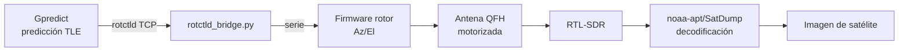

# 03 — Estación terrena de satélites meteorológicos

**Estado:** 🟡 En progreso — subsistema de rotor Az/El diseñado y probado en software

## Objetivo

Recibir y decodificar imágenes en vivo de satélites meteorológicos (NOAA APT / Meteor-M2 LRPT, banda 137 MHz) usando una antena QFH diseñada e impresa en 3D, con **seguimiento motorizado de dos ejes** para mantener la antena apuntada durante todo el pase.

## Por qué importa

Combina diseño mecánico de antenas, RF, doppler tracking, cinemática de motores y procesamiento de señal/imagen en un único sistema automatizado — demuestra integración de sistemas completa, no solo un componente aislado.

## Arquitectura del sistema

## Subsistemas

### 1. Antena QFH (recepción)

Antena Quadrifilar Helicoidal para 137MHz — polarización circular, patrón hemisférico sin nulos, la topología de referencia de la comunidad para recepción de satélites meteorológicos en órbita baja.

- 📐 [`antenna/qfh_design.md`](antenna/qfh_design.md) — frecuencia de diseño, justificación de topología, metodología de cálculo (calculadora de referencia de la comunidad + parámetros exactos a introducir), alimentación y balun
- 🖨️ [`antenna/qfh_support.scad`](antenna/qfh_support.scad) — soporte paramétrico de impresión 3D (valores de ejemplo, a sustituir por la salida real de la calculadora antes de imprimir)

### 2. Rotor de seguimiento automático Az/El

Motoriza el apuntamiento en dos ejes para seguir el paso del satélite en tiempo real en vez de apuntar fijo. Se apoya en el ecosistema estándar de radioafición (**Gpredict + protocolo `rotctld` de Hamlib**) en vez de reinventar la predicción orbital o el protocolo de control.

- 📐 [`rotor/rotor_design.md`](rotor/rotor_design.md) — arquitectura, elección de motor, cálculo de resolución angular (0.044°/paso) y limitaciones de par
- 🖨️ [`rotor/rotor_mount.scad`](rotor/rotor_mount.scad) — modelo paramétrico del rotor de dos ejes (OpenSCAD)
- 💻 [`rotor/firmware/rotor_firmware.ino`](rotor/firmware/rotor_firmware.ino) — firmware Arduino/ESP32 de control de motores
- 🌉 [`rotor/rotctld_bridge.py`](rotor/rotctld_bridge.py) — servidor que implementa el protocolo `rotctld` real, probado contra la especificación oficial de Hamlib (ver [`docs/rotctld_protocol_notes.md`](docs/rotctld_protocol_notes.md))

El puente `rotctld_bridge.py` incluye un **modo `--demo`** verificado end-to-end con el mismo protocolo de red que usa Gpredict (probado con `nc` contra la especificación real de `rotctld`, no solo simulado internamente) — evidencia de que la integración funciona antes de tener el hardware conectado.

## Material / BOM

| Elemento | Coste aprox. |
|---|---|
| RTL-SDR Blog v3 | ya disponible (Proyecto 01) |
| LNA opcional para 137 MHz | ~10-15€ |
| Elementos de la antena QFH (varilla/cable de cobre) | ~5€ |
| Soporte de antena impreso en 3D | 0€ |
| Motores 28BYJ-48 + driver ULN2003 x2 (rotor) | ~6-8€ |
| Arduino/ESP32 para el rotor | ya disponible |
| Raspberry Pi para automatización (opcional) | ya disponible/reutilizable |

## Resultados

*(Pendiente con hardware real)*

### Checklist pendiente

- [x] Diseñar la antena QFH/turnstile para 137 MHz (metodología, parámetros de calculadora y soporte 3D paramétrico listos)
- [ ] Ejecutar la calculadora de John Coppens con el conductor real elegido y el radio de doblez de la pieza impresa, obtener H1/Dc1/H2/Dc2 finales
- [ ] Imprimir el soporte con los valores finales e imprimir/doblar los 4 conductores helicoidales
- [ ] Configurar RTL-SDR + software de recepción (SDR++/gqrx)
- [ ] Decodificar señal APT/LRPT con `noaa-apt` o `SatDump`
- [ ] Montar el rotor físico e integrar con `rotor_firmware.ino`
- [ ] Probar `rotctld_bridge.py` con Gpredict real (verificar formato exacto de respuesta `get_pos`, ver nota en `docs/rotctld_protocol_notes.md`)
- [ ] Comparar calidad de imagen con antena fija vs. antena con seguimiento activo — esta comparación es el resultado más interesante del proyecto
- [ ] Documentar SNR y calidad de imagen por pase (elevación máxima, duración, seguimiento fijo vs. motorizado)

## Habilidades demostradas

- Enlaces de comunicación satelital y corrección de efecto doppler
- Automatización de sistemas de recepción
- Procesamiento de señal a imagen
- Diseño mecánico (cinemática de dos ejes, selección de motor por cálculo, no por intuición)
- Integración con protocolos y ecosistemas de software estándar (Hamlib/rotctld) en vez de reinventar soluciones ya resueltas
- Firmware embebido de control de motores + puente de protocolo de red

## Media

*(Añadir aquí imágenes de satélite decodificadas, fotos de la antena QFH y el rotor, comparación de pases con/sin seguimiento)*
