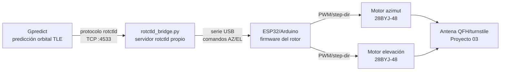

# Rotor de seguimiento automático (Az/El) para la estación terrena

## Objetivo

Motorizar el apuntamiento de la antena de la estación (Proyecto 03) en dos ejes — azimut y elevación — para que siga automáticamente el paso de un satélite en vez de apuntar fijo, mejorando la relación señal/ruido durante todo el pase en vez de solo cerca del cénit.

## Por qué importa (y por qué no es solo "un servo que gira")

Un sistema de seguimiento real tiene tres partes que deben funcionar juntas: **predicción orbital** (dónde está el satélite ahora), **cinemática del rotor** (cómo llevar la antena a esa posición) y **protocolo de control** (cómo se comunican el software de predicción y el hardware). La decisión de ingeniería importante aquí es **no reinventar la parte de predicción orbital ni el protocolo de control**: existen herramientas ya establecidas (Gpredict + Hamlib) que hacen ese trabajo de forma robusta desde hace más de 20 años. El valor añadido real del proyecto está en construir el rotor físico y hacerlo hablar el protocolo estándar (`rotctld`) para que se integre con ese ecosistema, en vez de crear un sistema aislado incompatible con todo lo demás.

## Arquitectura

`rotctld_bridge.py` implementa el subconjunto del protocolo de red `rotctld` de Hamlib (comandos `P`/`set_pos` y `p`/`get_pos`, ver [`docs/rotctld_protocol_notes.md`](../docs/rotctld_protocol_notes.md)), así que **Gpredict puede controlar el rotor directamente seleccionando "Hamlib rotctld" como backend**, sin necesidad de escribir ninguna integración a medida en Gpredict.

## Elección de motor y cálculo de resolución angular

Se eligen **motores paso a paso 28BYJ-48 + driver ULN2003** (muy baratos, ~2-3€ el conjunto, ampliamente disponibles) para ambos ejes.

Cálculo de resolución angular real (no el número "de memoria" que circula en tutoriales, sino calculado a partir de la relación de reducción real del engranaje interno):

- Ángulo de paso nativo del motor: $5.625°$
- Relación de reducción interna real: $63.684:1$ (la cifra comercial "1/64" es una aproximación redondeada)
- Pasos completos por vuelta de salida: $\frac{360°}{5.625°} \times 63.684 = 4076$ pasos
- **Resolución angular: $360°/4076 ≈ 0.088°$ por paso**

⚠️ Se usa **paso completo**, no medio paso, porque el firmware usa la librería estándar `Stepper.h` de Arduino con el constructor de 4 pines, que ejecuta una secuencia de paso completo (4 estados). El medio paso (que daría el doble de resolución, ~0.044°) requeriría una secuencia de 8 estados personalizada fuera del alcance de esa librería — no merece la pena la complejidad añadida dado el margen que ya hay respecto al ancho de haz de la antena (ver más abajo).

Esto sigue siendo muchísimo más fino de lo que hace falta: el ancho de haz de las antenas de este portfolio (QFH, Yagi) es de varios grados, así que el cuello de botella de precisión de apuntamiento nunca va a ser el motor.

## Limitación importante: par motor

El 28BYJ-48 tiene un par de sujeción modesto (~34 mN·m). Es suficiente para una antena ligera impresa en 3D (QFH/turnstile del Proyecto 03, unos 100-200 g), **pero no para la antena direccional de 600$** si esta resulta ser grande/pesada — esa antena, si se motoriza en el futuro, necesitará motores NEMA17 + driver A4988/DRV8825 (~10-15€ el conjunto), no este rotor barato. Este diseño se limita explícitamente al caso de uso "antena ligera de estación de satélites".

## Piezas mecánicas

Ver [`rotor_mount.scad`](rotor_mount.scad): base giratoria de azimut (plato + eje) y horquilla de elevación, diseño paramétrico para poder ajustar según el motor exacto que consigas.

## Estado

🔵 Diseño y cálculos completos, pendiente de impresión, montaje y prueba con Gpredict real.
