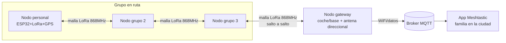

# 04 — Red de comunicación y localización GPS para alta montaña (LoRa/Meshtastic)

**Estado:** 🔵 Planeado — diseño y BOM cerrados con asunciones explícitas, pendiente de verificación de hardware

## Objetivo

Sistema de mensajería y seguimiento GPS off-grid para senderismo/alta montaña usando **Meshtastic** (firmware LoRa mesh open-source) sobre hardware genérico ESP32, resolviendo tres necesidades reales:

1. Track GPS fiable de la ruta, independiente de la calidad del GPS del móvil
2. Mensajería de texto entre miembros del grupo sin cobertura móvil
3. Puente ocasional de mensajes hacia la familia en la ciudad, cuando existe un nodo con conexión a internet dentro de alcance de la malla

## Por qué importa (y qué NO promete este proyecto)

A diferencia de un mensajero satelital comercial, este sistema **no garantiza cobertura desde cualquier punto de la montaña**. LoRa tiene alcance de varios km con línea de vista, pero se degrada fuerte con terreno intermedio. El punto 3 (familia en la ciudad) solo funciona si existe una cadena de nodos hasta un gateway con internet. Documentar esta limitación con datos reales de alcance en terreno alpino —no solo teóricos— es precisamente la parte más valiosa del proyecto para un portfolio de RF: pocos proyectos personales incluyen caracterización de propagación en campo real.

No se reimplementa el protocolo mesh: se usa el firmware Meshtastic ya existente (maduro, cifrado, con app propia). El valor de ingeniería está en la integración de hardware sobre placas genéricas, el diseño de antena correcto para la banda, el hack del GPS existente, y la caracterización de alcance real.

## ⚠️ Asunciones activas (pendientes de verificación por el usuario)

Este documento avanza con las siguientes asunciones razonables, marcadas explícitamente para no bloquear el progreso. Cuando se verifiquen, actualizar esta sección y el BOM:

| Asunción | Por qué se asume así | Verificar |
|---|---|---|
| Las antenas omnidireccionales de 12dBi que ya tienes son de 2.4GHz (WiFi/BT), **no válidas para 868MHz** | Es el kit típico que acompaña a placas ESP32-WROOM genéricas | Mirar etiqueta/datasheet; si son de 868/900MHz, se elimina esa partida del BOM |
| Conector SMA estándar (no RP-SMA) en módulos LoRa y antenas nuevas a comprar | Es el más común en módulos SX1276/78 de fabricantes genéricos | Confirmar al recibir el módulo LoRa antes de encargar antenas |
| El GPS USB se puede intervenir (acceder a TX/RX TTL internos) | La mayoría de ratones GPS USB llevan un chip GPS real + conversor UART-USB | Abrir la carcasa, localizar el chip, identificar el pinout con multímetro/datasheet; si no es viable, comprar un NEO-6M (~8€) como plan B |

## Arquitectura

## Diseño por fases

### Fase A — Nodo personal (tracker)

- ESP32-WROOM genérico + módulo LoRa SX1276/78 (868MHz, EU) cableado por SPI
- GPS: intento de hackear el GPS USB existente (acceso directo a UART TTL); plan B: NEO-6M nuevo
- Antena látigo de 868MHz (nueva, ~3€) — **no reutilizar las de 12dBi sin verificar banda**
- Pantalla OLED opcional para ver posición/mensajes sin depender del móvil
- Carcasa impresa en 3D resistente a intemperie

### Fase B — Nodos de grupo (mesh básico)

- 2-4 nodos adicionales: ESP32-WROOM + módulo LoRa + antena 868MHz
- Sin GPS (más barato) salvo que el presupuesto lo permita más adelante
- Mismo firmware Meshtastic, configuración de "custom device" con el pinout definido para hardware genérico

### Fase C — Nodo gateway/repetidor

- ESP32-WROOM + módulo LoRa + WiFi (ya integrado en el ESP32) para bridging MQTT
- Ubicado en coche/trailhead/casa cercana a la ruta
- **Aquí es donde tiene sentido tu antena direccional de 600$**: apuntada hacia la ruta habitual, es lo que más extiende el alcance real hacia el grupo en montaña
- Antes de usarla: confirmar banda, ganancia y patrón de radiación reales (pendiente de tus datos), y verificar límites legales de EIRP en la sub-banda ISM 868MHz usada (normativa ETSI EN 300 220 — potencia y ciclo de trabajo limitados; una antena de alta ganancia sin ajustar la potencia de TX puede superar el límite legal)

## Material / BOM (con asunciones del apartado anterior)

| Nodo | Ya disponible | Falta comprar (estimado) |
|---|---|---|
| Personal (tracker) | ESP32-WROOM, soldador, GPS USB a intervenir | Módulo LoRa 868MHz (~7€), antena 868MHz (~3€), OLED opcional (~3€) |
| Grupo x3-4 | ESP32-WROOM x3-4 | Módulo LoRa x3-4 (~25€), antenas 868MHz x3-4 (~10€) |
| Gateway | Antena direccional 600$ (pendiente de specs) | Módulo LoRa (~7€), adaptador de conector si no coincide (~2€) |

**Total estimado (sin contar la antena direccional, ya en posesión): ~55-70€**

## Resultados

*(Pendiente — completar con: mapa de cobertura real de la malla en terreno alpino, alcance medido nodo-a-nodo vs. teórico, tiempo de vida de batería en campo, casos reales de bridging hacia la familia)*

## Habilidades demostradas

- Integración de hardware LoRa sobre placas genéricas (definición de "custom device" en Meshtastic)
- Ingeniería inversa/hacking de hardware existente (GPS USB) por restricción de presupuesto
- Selección de antena por banda de frecuencia (no por ganancia nominal aislada)
- Caracterización de propagación RF en terreno real no ideal (frente al caso de laboratorio de los Proyectos 01-02)
- Arquitectura de bridging LoRa→MQTT→internet
- Conocimiento regulatorio básico de EIRP/duty cycle en banda ISM

## Media

*(Pendiente — mapas de cobertura, fotos de los nodos, capturas de la app Meshtastic en ruta real)*
